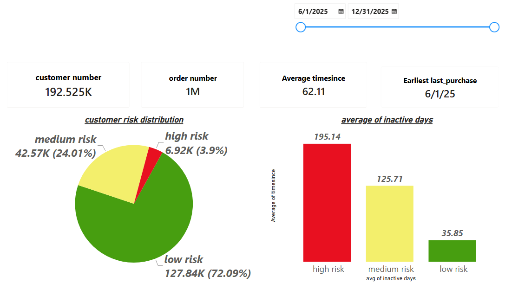

# Customer Churn & Risk Analysis Dashboard

## 📌 Project Overview
This project focuses on analyzing customer purchasing behavior to identify churn risk levels. By establishing a direct connection between a **PostgreSQL** database and **Power BI**, the data was extracted, transformed, and visualized to provide actionable insights for customer retention strategies. 

## 🎯 Business Problem
Understanding customer engagement is crucial for business growth. The goal of this analysis is to categorize customers into risk segments (High, Medium, Low) based on their recency (days since last purchase) and provide a clear overview of the customer base to help decision-makers target at-risk customers proactively.

## 🛠️ Tools & Technologies Used
* **Database Management:** PostgreSQL (Data extraction, CTEs, and querying).
* **Data Visualization & Analytics:** Microsoft Power BI (Data modeling, DAX, and interactive dashboard design).
* **Environment Setup:** Configured a seamless data pipeline across macOS and virtualized environments.

## 📊 Key Insights & Findings
* **Customer Base:** Successfully analyzed a massive dataset comprising over **192K customers** and **1 Million orders**.
* **Risk Distribution:**
  * **Low Risk:** Represents the majority of the customer base (~72%), with an excellent average recency of just **35 days** since their last purchase.
  * **Medium Risk:** Accounts for ~24% of customers, averaging **125 days** since their last purchase.
  * **High Risk:** A critical segment of ~4% requiring immediate marketing intervention, showing an average absence of **195 days**.
* **Interactive Elements:** The dashboard includes time-intelligence slicers allowing users to filter risk metrics by specific date ranges seamlessly.

## 📁 Repository Structure
* `Customer_Churn_Analysis.pbix`: The interactive Power BI report file.
* `Dashboard_Preview.pdf`: A static PDF export of the dashboard for quick viewing.
* `data_extraction.sql`: The SQL script used to query and structure the raw data from the PostgreSQL database.
* `dashboard.png`: High-resolution screenshot of the dashboard.

---
**Author:** Mahmoud Amer
*Data Analyst | Healthcare & Business Analytics*
